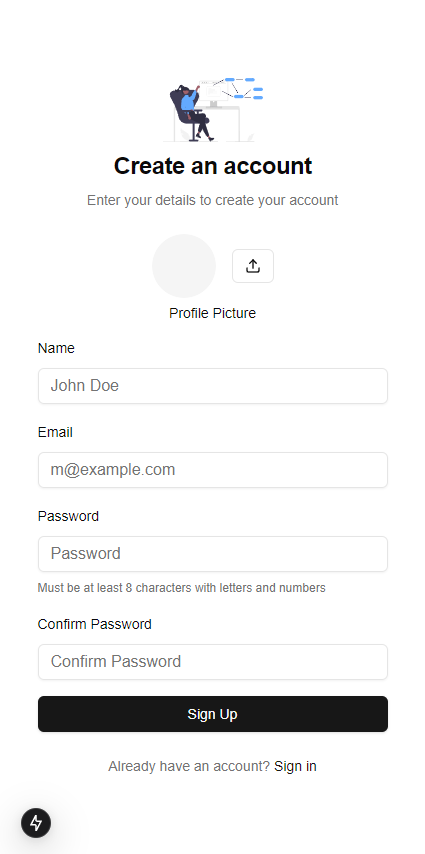

# Role-Based Access Control (RBAC) System

A modern and secure role-based access control system built with Next.js 14, Convex, and Tailwind CSS. This system provides a robust authentication and authorization framework with a beautiful user interface.


## ✨ Features

- **Authentication System**
  - Email & Password Authentication
  - Guest/Viewer Access
  - Secure Password Handling
  - Profile Picture Upload

- **Role Management**
  - Multiple User Roles (Admin, Manager, User, Viewer)
  - Dynamic Permission System
  - Role-based UI Adaptation

- **User Management**
  - Create/Edit/Delete Users
  - Status Management (Active/Inactive)
  - Profile Management
  - Search & Filter Capabilities

- **Modern UI/UX**
  - Responsive Design
  - Dark Mode Support
  - Toast Notifications
  - Loading States
  - Interactive Animations

## 🖼️ Screenshots

<!-- Add your screenshots here -->
### Authentication
Sign-in and Sign-up pages
<div style="display: flex; justify-content: space-between; gap: 20px; margin: 20px 0;">
    
    
</div>


### Dashboard
Super-Admin and Admin Dashboard
<div style="display: flex; justify-content: space-between; gap: 20px; margin: 20px 0;">
    
    
</div>

User and Viewer Dashboard
<div style="display: flex; justify-content: space-between; gap: 20px; margin: 20px 0;">
    
    
</div>


## 🛠️ Tech Stack

- **Frontend**
  - Next.js 15
  - TypeScript
  - Tailwind CSS
  - Shadcn UI
  - Lucide Icons

- **Backend**
  - Convex (Backend as a Service)
  - Real-time Data Sync

- **Authentication**
  - Custom Auth System
  - JWT Tokens
  - Secure Password Hashing

## 🚀 Getting Started

1. Clone the repository

```bash
git clone https://github.com/yourusername/rbac.git
```

2. Install dependencies
```bash
npm install
```

3. Set up environment variables
```bash
cp .env.example .env.local
```

4. Start the development server
```bash
npm run dev
```

5. Open [http://localhost:3000](http://localhost:3000)

## 🔐 User Roles

| Role        | Permissions                                    |
| ----------- | ---------------------------------------------- |
| Super-Admin | Full system access, manage all users and roles |
| Admin       | Manage users with lower roles, view all data   |
| User        | Basic access, view and edit own profile        |
| Viewer      | Read-only access to system                     |


## 📝 License

This project is licensed under the MIT License - see the [LICENSE](LICENSE) file for details.

## 👨‍💻 Author

Roy - [GitHub](https://github.com/R0Y15)

---

<p align="center">Made with ❤️ by Roy</p>
